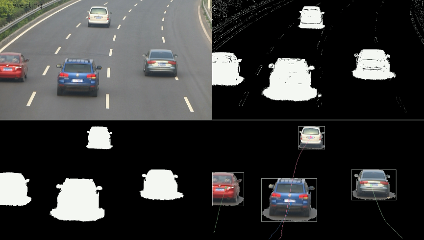

# Xiangfei Meng个人介绍

   目前在出海公司，带领技术团队，对 xxx （海外直播 app）的美颜美妆效果负责。团队技术栈涉及图形图像算法、深度学习、C++、OpenGL。

2020~2021年，对 xxx（海外短视频app）的 GAN 模型在 iOS 端的推理效率负责。涉及推理引擎在 iOS 端的 GPU 优化。效率领先于 TFLite、CoreML-Metal、MNN。

2018~2019年，对 xxx（海外短视频app）的服务端超分算法负责。

2015~2018年，以第一名成绩考入北京航空航天大学，取得计算机硕士学位。

2011~2015年，在中国民航大学，取得计算机本科学士学位。

工作/居住地：杭州。

业余爱好：音乐。

近期动向：AI Infra 探索中。

工作理念

1. 做好设计，写好代码，不留屎山。
2. 理解复杂，输出简单。
3. 国外再领先的技术，也能被我们超越。
4. 用技术让生活更美好。

## 业界项目

### 1. 移动端直播视频美颜 (2022至今)

- 美颜美妆是视频直播 app 中，主播开播的刚需。
- 对 xxx（海外直播app）的美颜美妆效果负责。重点效果：磨皮、美型美体、智能美颜、AI 美妆。
- 磨皮算法，在匀肤、遮瑕、肤质、清晰度上，与一流竞品持平，部分更优。利用 AI 肤色分割实现发丝级清晰度保留。
- 美型美体算法，在空域和时域稳定性上，与一流竞品持平，部分更优。
- 智能美颜，根据脸型特征，自适应匹配最优美颜参数。
- AI 美妆，初代模型可实时生成更真实自然的美妆效果，二代模型支持妆容迁移。

### 2. 移动端深度学习推理引擎 (2020~2021)

- 短视频 app 实时录制漫画脸、变老变小变年轻等效果，需要一个支持移动端实时对 GAN 模型做推理的引擎。
- 在移动端深度学习推理引擎中，独立负责 Metal（iOS GPU）优化，成功支持 xx（海外短视频app） 的 GAN 模型上线和实时推理。
- 在 Metal 上实现业界最快的 Winograd 卷积算法，超越已知最快的 TFlite 约 15%~25%。
- 从编译选项、图优化、线程调度、计算优化、访存优化上全面提升推理引擎性能。2021 年 Metal 速度达到业界 Top 1。
- DSP 推理支持（失败）。

### 3. 视频增强算法 (2018~2019)

- 负责 xx（海外短视频app）真实场景的**视频超分辨率**算法。是公司部署的首个服务端视频增强算法。
- 构造真实场景数据（噪声、编码块、多场景、YUV），训练光流信息增强的循环神经网络，提升低清视频的分辨率。各项视频观看指标均有提升。
- 对去编码块效应、色彩增强、降噪算法略有研究。

### 4. 关键点驱动人脸动画 (animoji) (2018)

- 实现 xx（海外短视频app）中的实时 “AI” 换脸。
- 利用 3DMM 对人脸建模，利用关键点求解 blendshape 表情基系数，将表情迁移至另一张人脸图像，实现人脸动画。

## 学校项目

### 1. 鱼的实时动捕和运动重定向 (2017)

   

动捕设备动辄数十万。该项目旨在利用单摄像头，捕捉鱼的动画，重定向到其他的类鱼卡通角色上。

利用运动目标检测和自适应阈值分割，检测鱼的轮廓边缘。

对轮廓用椭圆傅里叶系数做拟合，用来鲁棒地定位中轴线（medial axis）和鱼身关键点。（至此完成动捕）。

对类鱼的卡通角色，做三角剖分，并用摄像头画面中的鱼的关键点作为控制点，用 MLS 算法驱动网格形变。逐帧实时形变实现鱼动画。（至此完成运动重定向）。

   **Publication**:
   Xiangfei Meng, Junjun Pan, Hong Qin, Pu Ge. **Real-time Fish Animation Generation by Monocular Camera**. *Computers & Graphics*. 71(2018): 55-65. [[pdf](paper/XiangfeiCAG.pdf)]

   Xiangfei Meng, Junjun Pan, Hong Qin. **"Motion Capture and Retargeting of Fish by Monocular Camera."** *2017 International Conference on Cyberworlds (CW 2017), IEEE*, Chester, UK, September 20-22, 2017. [[pdf](paper/XiangfeiCW2017.pdf)][[video](img/FishDemo.mp4)]

### 2. STL部分实现 (2016)

   纯兴趣驱动，部分实现了 STL 中的 C++ 容器（vector, list, deque）、迭代器（ordinary iterator, constant iterator, reverse iterator）、适配器（stack, queue, priority_queue）、算法（sort, find）。使用底层内存管理、模板特化和偏特化、函数对象等技术。

### 3. Ray Tracer (2016)

   

    纯兴趣驱动，C++实现一套光线追踪渲染器，支持三角形和球形两种形状。支持全局光照（直接光照+间接光照），包含环境光、漫反射、高光、反射、投射、软阴影、渗色。渲染康奈尔盒子如上图。

    Implemented a ray tracer as an offline renderer. This renderer is equipped with a parser to analyze model files containing triangles and spheres. The scene is then rendered with global illumination, which includes effects of ambient, diffuse, specular, reflection, refraction, soft shadow and color bleeding. The rendering process is speeded up by OpenMP with thread-level parallelization.

### 4. Pascal Compiler (2015)

   

    纯兴趣驱动，用 C++ 实现一套 Pascal（类C的面向过程语言）编译器。可将高级语言翻译成 intel-i386 汇编代码执行。编译期支持嵌套函数、递归调用、值传递与引用传递功能。

 	Implemented a Pascal Compiler using pure C++ without other lexical/syntax tools. The compiler parses Pascal source code and translates it to Intel-i386 assembly code. The assembled executable can run on the Windows operating system. The compiler provides full support for nested function definitions, recursion callings of functions, and the parameter passing either by values or references.

### 5. Spammer Detection in Social Networks (2014)

    用 C4.5 决策树，自动检测新浪微博上的垃圾账号。10折交叉验证，得到 0.706 F1 Score。

   Spammer detection is a typical scenario of the application of classifiers. To detect spammers in social networks, we collected 4109 profiles from [Weibo](http://weibo.com/), extracted their features, and delivered them to several classifiers. We implemented a Bayesian classifier and a C4.5 Decision Tree classifier. Bayesian classifier is theoretically optimal as long as the conditional probability density functions are known, and the Decision Tree is independent of dimensions. Through the 10-fold cross-validation, the Bayes Classifier showed 58.3% in recall, 85.4% in precision, and 0.693 in F1-Measure, and the Decision Tree showed 60.1% in recall rate, 85.4% in precision, and 0.706 in F1-Measure.

   Publication:
   孟祥飞, 徐路, 王思雨. 基于新浪微博的社交网络垃圾用户分析与检测[J]. 科技与创新, 2014(15):125-127. [[pdf](paper/基于新浪微博的社交网络垃圾用户分析与检测.pdf)]
   张宇翔, 孙菀, 杨家海, 周达磊, 孟祥飞, 肖春景. 新浪微博反垃圾中特征选择的重要性分析[J]. 通信学报, 2016, 37(8):24-33. [[pdf](paper/新浪微博反垃圾中特征选择的重要性分析.pdf)]

### 6. Moving Object Tracking (2013)

   

    运动目标检测是传统 CV 领域的一个基础问题。它可以提供运动目标的有无、位置、速度、轨迹、包围盒等信息，为后续高级语义分析提供支持。

    我们实现了基于静态相机的实时运动目标检测。

1. 使用混合高斯模型（GMM）对前背景像素做建模和分割
2. 使用形态学操作去噪，并定位图像中的连通域。
3. 使用最大先验概率算法，对前后帧的运动目标做关联跟踪，并处理目标的分裂、合并、出现、消失。
4. 使用卡尔曼滤波，跟踪运动目标轨迹。

    在一个典型的桌面 PC 上（2.9GHz CPU，4GB内存），对 640x480 图像，处理帧率可达 20fps，满足实时标准。

   Moving object tracking is a classical problem of Computer Vision since it can provide essential information on the shape and motion of the foreground objects.

   We implemented a real-time moving object tracking system with a static camera.

1. Segment foreground pixels with the Gaussian Mixture Model (GMM), which is a pixel-wise process.
2. Employ a morphology-open filter to eliminate the salt-and-pepper noise and a connected component identification to label the salient components as foreground objects.
3. Identify the correspondence between consecutive frames by a Max A Priori algorithm, and handle the splitting, merging, appearing and vanishing of objects.
4. Estimate trajectories of detected objects by a group of Kalman Filters.

   The system is robust to the slight shaking of the camera, and the gradual change of the light. It can reach 20 FPS with 640×480 resolution on my laptop equipped with a 2.9GHz CPU and 4GB memory.

## 联系方式

xiangfei_meng@163.com
