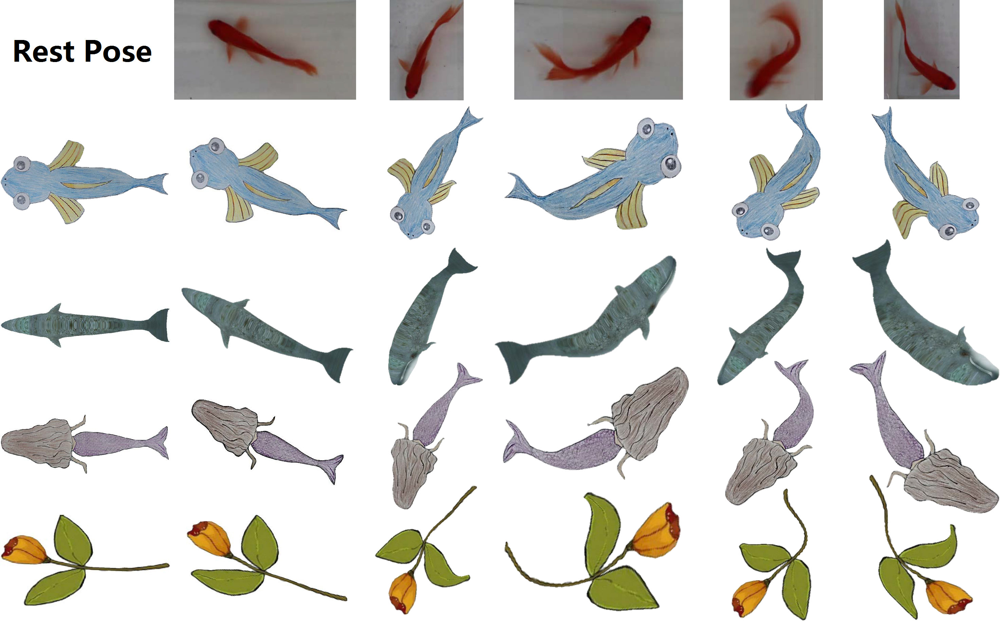
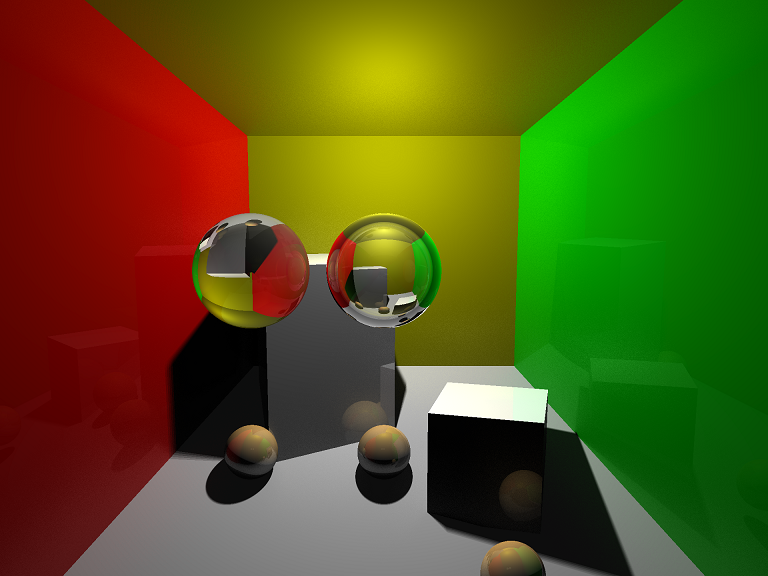
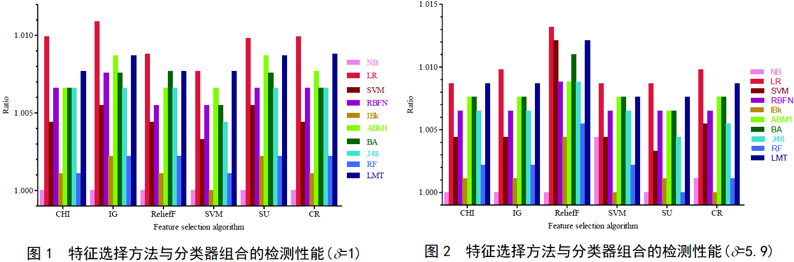
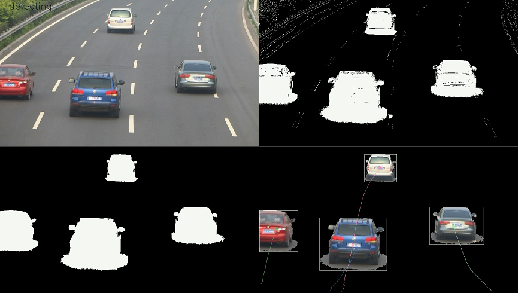

# Xiangfei Meng (孟祥飞)

  
Xiangfei Meng is currently a second-year master student under the supervision of Professor [Hong Qin](https://www.cs.stonybrook.edu/people/faculty/HongQin) at State Key Laboratory of Virtual Reality Technology and Systems, School of Computer Science and Engineering (SCSE), [Beihang University](http://www.buaa.edu.cn/) (BUAA). He received his bachelor's degree in Computer Science and Technology from [Civial Aviation University of China](http://www.cauc.edu.cn/zh/) (CAUC) as an "**Outstanding Graduate**" in 2015. He got the honorary title of "**Top-10 College Students in CAUC**" in October 2014. After that, he passed the National Entrance Examination for Postgraduate for SCSE, BUAA in December 2014 as the **top-score student** and attended BUAA as a postgraduate in September 2015.

His research interests include Computer Vision, Machine Learning, and Computer Graphics. Recently, he specifically focuses on data-driven animation generating approaches.

## Education

| Time				| School								 |  Phase      | Ranking	|
| :---------------- | :------------------------------------- | :---------   | :--------- |
| 2015/09 – 2018/03	| Beihang University					| Postgraduate  | Top 5%	|
| 2011/09 – 2015/06 | Civil Aviation University of China	| Undergraduate |  Top 5%	|
| 2008/09 – 2011/06 | Taiyuan No. 5 Middle School			| Senior High	| Top 30%	|

## Skills
1. Experienced **C/C++** programming skills with good coding style.
2. Familiar with **Computer Vision**, **Machine Learning**, and **Computer Graphics**.

## Internship

### 1. Microsoft - Software Development
(2017/06/01 - 2017/09/01)

Project 1. Incident Search Engine

Building a search engine (named *CosmosSearch*) for the Cosmos Incident Management System, which can provide potential solutions to Cosmos users whose cloud jobs are failed. The search engine extracts the key words and domain-specific words from users' error messages and retrieves the similar issues from the existing incident log files, and finally, provide users with the issue descriptions and corresponding solutions. Its main contribution is saving both users' time of submitting incident reports to designated responsible individuals (DRIs), and DRIs' time for laboriously checking each incident reports.

Project 2. Data-Driven Test for Intellisense in Visual Studio

Building a data-driven test module (named *Playback*) for Intellisense in Visual Studio. The main functionality of Intellisense is to auto-complete the source code while programmers are writing. However, there are countless grammatical token combinations which can hardly be covered by unit tests. Therefore, we built Playback to collect the submitted scripts from cloud, checked each script, and gathered the checking result to generate an Intellisense bug report.

<!-- 
The checking process starts with dividing a script consisting of K tokens into K code fragments. The n-th code fragment is cut out from the original script, beginning at the first token and ending at the n-th token. Each code fragment is inputted into Intellisense, from which a list of completion tokens are obtained. Playback then checks whether the next token after the code fragment is contained in the completion list.
-->

## Projects

### 1. Fish Motion Capture and Retargeting by Monocular Camera 
(2016/05 – 2017/05)

Motion capture and retargeting of fish generally have difficulties in marker attachment and feature description of the soft body. We present a contour-based feature extraction to extract the motion pattern of a fish in a video taken by a monocular camera. A two-level motion retargeting scheme is proposed to retarget the recorded motion to a new fish model, regardless of its body and fin proportions. As a result, we can drive a hand-drawn fish or a fish-like character (say a mermaid, or aflower) to swim with the same motion style as the real one in the video.

Publication:  
Xiangfei Meng, Junjun Pan, Hong Qin. **"Motion Capture and Retargeting of Fish by Monocular Camera."** *2017 International Conference on Cyberworlds (CW 2017), IEEE*, Chester, UK, September 20-22, 2017, to appear.[pdf]

### 2. Part Implementation of STL 
(2016/04 – 2016/05)  

Partly implemented the C++ standard template library (STL), including several types of containers (vector, list, deque), their corresponding iterators (ordinary iterator, constant iterator, reverse iterator), a few container adaptors (stack, queue, priority_queue) and some common algorithms (sort, find). Mainly used C++ features include low-level memory management, specialization and the part specialization of template, function object, etc.

### 3. Ray Tracer 
(2016/03 – 2016/04)

Implemented a ray tracer as an offline renderer. This renderer is equipped with a parser to analysis model files containing triangles and spheres. The scene is then rendered within global illumination, which includes effects of ambient, diffuse, specular, reflection, refraction, soft shadow and color bleeding. In addition, the rendering process is speeded up by using OpenMP to accomplish thresh-level parallelization.

### 4. Pascal Compiler 
(2015/09 – 2016/02)  

Implemented a Pascal Compiler using C++. The compiler can process Pascal source code and transfer it to
the Intel-i386 assembly code. The assembled executable program can be run on Windows operating system. The compiler provides full support for nested function definitions, recursion callings of functions, and the parameter passing either by values or references.

### 5. Spammer Detection in Social Networks 
(2013/06 – 2014/05)

Spammer detection is a typical scenario of the application of classifiers. To detect spammers in social networks, we collected 4109 profiles from [Weibo](http://weibo.com/), extracted their features and delivered them to several classifiers. We implemented a Bayesian classifier and a C4.5 Decision Tree classifier, for the Bayesian classifier is theoretically optimal as long as the conditional probability densities functions are known, and the performance of Decision Tree is independent of dimensions. Through the 10-fold cross validation, the Bayes Classifier showed 58.3% in recall rate, 85.4% in precision, and 0.693 in F1-Measure, and the Decision Tree showed 60.1% in recall rate, 85.4% in precision, and 0.706 in F1-Measure.

Publication:  
孟祥飞, 徐路, 王思雨. 基于新浪微博的社交网络垃圾用户分析与检测[J]. 科技与创新, 2014(15):125-127. [pdf](paper/基于新浪微博的社交网络垃圾用户分析与检测.pdf)  
张宇翔, 孙菀, 杨家海, 周达磊, 孟祥飞, 肖春景. 新浪微博反垃圾中特征选择的重要性分析[J]. 通信学报, 2016, 37(8):24-33. [pdf](paper/新浪微博反垃圾中特征选择的重要性分析.pdf)

### 6. Moving Object Tracking 
(2012/06 – 2013/05)

Moving object tracking is a classical problem in the field of Computer Vision since it can provide essential information on the shape and motion of the foreground objects. We implemented a moving object tracking system, which can track moving objects through image sequences taken by a static camera in real time. First, the system identifies foreground and background pixels through Gaussian Mixture Model, which is a pixel-wise process. Then it uses a morphology-open filter to eliminate the salt-and-pepper noise and employs the component analysis to label the salient components as foreground objects. Afterward, the corresponding between consecutive frames is accomplished by a Max A Priori algorithm, and the splitting, merging, appearing and vanishing of objects is handled meanwhile. Finally, the trajectories of detected objects are estimated by a group of Kalman Filters. The system is robust to the slight shaking of the camera and the gradual change of the light. It is able to process 20 frames (640×480 pixels) per second with a 2.9GHz processor and 4GB memory.

## Contact
[MengXiangfei_job@163.com](mailto:MengXiangfei_job@163.com) (for recruiting business)  
[XiangfeiMeng@buaa.edu.cn](mailto:XiangfeiMeng@buaa.edu.cn) (for academic communication)

### Organization
[State Key Laboratory of Virtual Reality Technology and System](http://vrlab.buaa.edu.cn/)  
[School of Computer Science and Engineering](http://scse.buaa.edu.cn/buaa-css-web/initAction.action)  
[Beihang University](http://www.buaa.edu.cn/)

### Address
[Beihang University, Xue Yuan Road No.37, Hai Dian District, Beijing](http://ditu.amap.com/place/B000A830XU)  
100191, China
